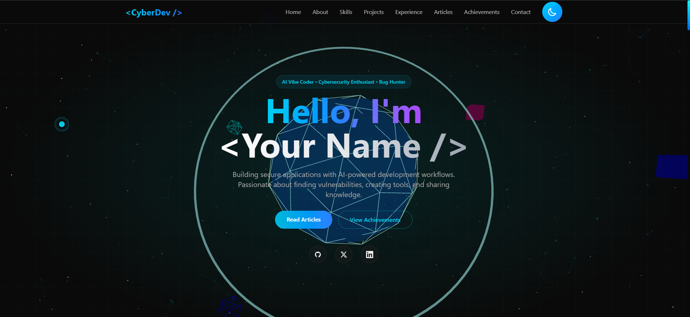

# CyberSecurity Portfolio 🛡️

A modern, interactive portfolio website for cybersecurity enthusiasts and AI vibe coders. Features 3D animations, dark/light mode, achievements game, and responsive design.



## 🚀 Live Demo

**[View Live Demo](https://your-portfolio-url.com)**

## ✨ Features

- **3D Animated Hero** - Interactive Three.js scene with floating geometries and particle effects
- **Dark/Light Mode** - Smooth theme transitions with system preference detection
- **Particle Background** - Interactive particles that respond to mouse movement
- **Custom Cursor** - Animated cursor with trail effect (desktop only)
- **Projects Showcase** - 3D tilt cards with category filters
- **Experience Timeline** - Animated timeline for work/education/certifications
- **Skills Visualization** - Radar chart + animated skill bars
- **Achievements Game** - Gamified achievement system with progress tracking
- **Testimonials Carousel** - Auto-scrolling testimonials with ratings
- **Cybersecurity Articles** - Filterable articles section
- **Scroll Progress Indicator** - Gradient progress bar
- **Fully Responsive** - Mobile-first design with smooth animations

## 🛠️ Tech Stack

- **Framework:** [Next.js 16](https://nextjs.org/) (App Router)
- **Language:** [TypeScript](https://www.typescriptlang.org/)
- **Styling:** [Tailwind CSS v4](https://tailwindcss.com/)
- **3D Graphics:** [Three.js](https://threejs.org/) + [React Three Fiber](https://docs.pmnd.rs/react-three-fiber)
- **Animations:** [Framer Motion](https://www.framer.com/motion/)
- **Theme Management:** [next-themes](https://github.com/pacocoursey/next-themes)

## 📦 Installation

### Prerequisites

- Node.js 18.17 or later
- npm, yarn, or pnpm

### Clone the Repository

```bash
git clone https://github.com/yourusername/cybersecurity-portfolio.git
cd cybersecurity-portfolio
```

### Install Dependencies

```bash
npm install
# or
yarn install
# or
pnpm install
```

## 🏃 Running the Project

### Development Mode

```bash
npm run dev
# or
yarn dev
# or
pnpm dev
```

Open [http://localhost:3000](http://localhost:3000) in your browser to see the result.

### Production Build

```bash
npm run build
npm run start
```

### Linting

```bash
npm run lint
```

## 🚀 Deployment

### Deploy to Vercel (Recommended)

[](https://vercel.com/new/clone?repository-url=https://github.com/yourusername/cybersecurity-portfolio)

#### Step-by-Step Vercel Deployment:

1. **Push to GitHub:**
   ```bash
   git init
   git add .
   git commit -m "Initial commit"
   git branch -M main
   git remote add origin https://github.com/yourusername/cybersecurity-portfolio.git
   git push -u origin main
   ```

2. **Deploy on Vercel:**
   - Go to [vercel.com](https://vercel.com) and sign up/login
   - Click "Add New..." → "Project"
   - Import your GitHub repository
   - Vercel will auto-detect Next.js settings
   - Click "Deploy"

3. **Environment Variables (Optional):**
   - If using any API keys, add them in Vercel dashboard:
     - Go to Project → Settings → Environment Variables
     - Add your variables

### Deploy to Cloudflare Pages

1. **Push to GitHub:**
   ```bash
   git init
   git add .
   git commit -m "Initial commit"
   git branch -M main
   git remote add origin https://github.com/yourusername/cybersecurity-portfolio.git
   git push -u origin main
   ```

2. **Deploy on Cloudflare:**
   - Go to [Cloudflare Dashboard](https://dash.cloudflare.com)
   - Navigate to "Pages" → "Create a project"
   - Select "Connect to Git"
   - Choose your GitHub repository
   - Configure build settings:
     - **Framework preset:** Next.js
     - **Build command:** `npm run build`
     - **Build output directory:** `.next`
   - Click "Save and Deploy"

3. **Note:** Cloudflare Pages requires `@cloudflare/next-on-pages` adapter for full Next.js compatibility. You may need to set that up.

### Deploy to GitHub Pages (Static Export)

1. **Configure for Static Export:**
   
   Update `next.config.ts`:
   ```typescript
   import type { NextConfig } from "next";

   const nextConfig: NextConfig = {
     output: 'export',
     images: {
       unoptimized: true,
     },
   };

   export default nextConfig;
   ```

2. **Build Static Site:**
   ```bash
   npm run build
   ```

3. **Deploy to GitHub Pages:**
   - Install `gh-pages`:
     ```bash
     npm install --save-dev gh-pages
     ```
   - Add scripts to `package.json`:
     ```json
     {
       "scripts": {
         "deploy": "gh-pages -d out"
       }
     }
     ```
   - Run deployment:
     ```bash
     npm run build
     npm run deploy
     ```

## 📁 Project Structure

```
cybersecurity-portfolio/
├── src/
│   ├── app/
│   │   ├── layout.tsx       # Root layout with theme provider
│   │   ├── page.tsx         # Main page component
│   │   └── globals.css       # Global styles
│   ├── components/
│   │   ├── Hero.tsx         # Hero section with 3D elements
│   │   ├── Hero3D.tsx       # Three.js 3D scene
│   │   ├── Navigation.tsx   # Navigation bar
│   │   ├── ThemeToggle.tsx  # Dark/light mode toggle
│   │   ├── CustomCursor.tsx # Custom cursor effect
│   │   ├── ParticleBackground.tsx
│   │   ├── ScrollProgress.tsx
│   │   ├── AboutSection.tsx
│   │   ├── EnhancedSkillsSection.tsx
│   │   ├── ProjectsSection.tsx
│   │   ├── ExperienceSection.tsx
│   │   ├── ArticlesSection.tsx
│   │   ├── AchievementsGame.tsx
│   │   ├── TestimonialsSection.tsx
│   │   ├── ContactSection.tsx
│   │   └── Footer.tsx
│   ├── context/
│   │   └── ThemeProvider.tsx
│   └── data/
│       ├── articles.ts
│       ├── achievements.ts
│       ├── projects.ts
│       ├── experience.ts
│       └── testimonials.ts
├── public/
├── package.json
├── tailwind.config.ts
├── tsconfig.json
└── README.md
```

## 🎨 Customization

### Update Personal Information

1. **Hero Section:** Edit `src/components/Hero.tsx`
   - Update name, title, and description
   - Change social links (GitHub, Twitter, LinkedIn)

2. **Projects:** Edit `src/data/projects.ts`
   - Add your own projects with details

3. **Experience:** Edit `src/data/experience.ts`
   - Add your work experience and education

4. **Articles:** Edit `src/data/articles.ts`
   - Add your blog posts or articles

5. **Achievements:** Edit `src/data/achievements.ts`
   - Add your certifications and awards

6. **Testimonials:** Edit `src/data/testimonials.ts`
   - Add recommendations from colleagues

### Change Theme Colors

Update colors in `src/app/globals.css`:

```css
:root {
  --background: #ffffff;
  --foreground: #171717;
  --card: #f5f5f5;
}

.dark {
  --background: #0a0a0a;
  --foreground: #ededed;
  --card: #1a1a1a;
}
```

## 📸 Adding Screenshot

1. Run the development server:
   ```bash
   npm run dev
   ```
2. Open [http://localhost:3000](http://localhost:3000)
3. Take a screenshot of the hero section
4. Save it as `screenshot.png` in the root directory

## 🤝 Contributing

Contributions are welcome! Please feel free to submit a Pull Request.

1. Fork the repository
2. Create your feature branch (`git checkout -b feature/AmazingFeature`)
3. Commit your changes (`git commit -m 'Add some AmazingFeature'`)
4. Push to the branch (`git push origin feature/AmazingFeature`)
5. Open a Pull Request

## 📄 License

This project is licensed under the MIT License - see the [LICENSE](LICENSE) file for details.

## 🙏 Acknowledgments

- [Next.js](https://nextjs.org/) - The React Framework
- [Three.js](https://threejs.org/) - 3D Graphics Library
- [Framer Motion](https://www.framer.com/motion/) - Animation Library
- [Tailwind CSS](https://tailwindcss.com/) - Utility-First CSS Framework

## 📧 Contact

Your Name - [@yourtwitter](https://twitter.com/yourtwitter) - email@example.com

Project Link: [https://github.com/yourusername/cybersecurity-portfolio](https://github.com/yourusername/cybersecurity-portfolio)

---

⭐ Star this repository if you find it useful!